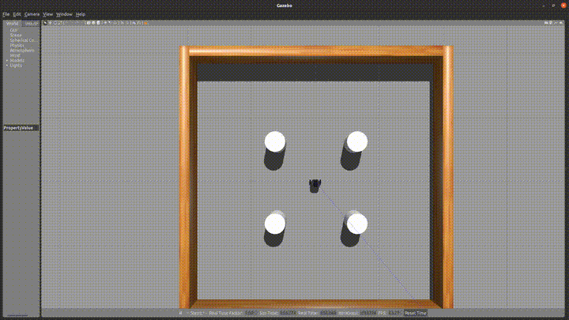
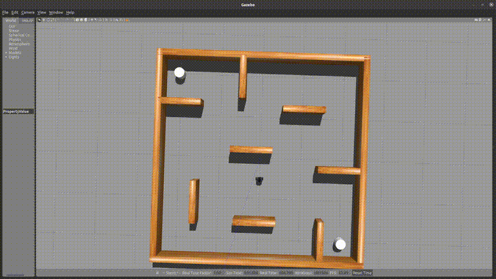

[](https://classroom.github.com/a/IVPa5jQQ)
# Turtlebot Navigation

### Deadline : September 27th, 2024 11:59pm

***This assignment is to be done as individuals, not with partners nor with teams.***

### How to get started →

Begin by reading this entire writeup and making sure you have a good understanding of it. Next, spend a good amount of time, maybe an entire day, planning and sketching out on paper how you’re going to solve this assignment. Take note of the topics in the [resources](#Resources) section as your questions might already be covered there. You should aim on identifying what features you need to implement, which ROS nodes and topics you’ll need and how you’ll test and evaluate your package.

---
# Introduction

Reactive controllers, i.e. controllers that operate only on the local information obtained from their sensors, are an important tool in the robotics toolbox because in many cases your robot does not have the global information of the world. In such scenarios, the robot must utilise only the local information that it has, i.e. whatever it can currently sense, to safely navigate the world and complete its task. The Bug 2 Algorithm taught in the video lectures is one such method of navigating. It works by switching between 2 behaviours - goal-seek and wall-follow based on some criteria. 

In this assignment, you will be implementing a wall following behaviour for the turtlebot3 and combining your it with your implementation of the goal-seek behaviour from the class activity into a Bug 2 navigation algorithm. The details for each are specified further below. 

---
# Assignment Information

Your algorithms/methods must be implemented on a simulated turtlebot3 (burger model) in the gazebo simulation that was used in the goal-seek activity. You will be implementing the wall-follower for part 1 and the bug 2 algorithm for part 2.  
Begin by cloning this repository in the src directory of your catkin workspace and building it with catkin after you create an empty src directory inside. This repository is a ROS package that contains two launch files, one for each part of the assignment. The launch files have the code to launch the correct envrionments that each part will be tested in. 

### Objectives

- Learn to implement behaviors in robot control
- Learn to switch between different behaviours based on sensor data
- Understand reactive controllers

### Resources
- Including Launch Files: https://wiki.ros.org/roslaunch/XML/include
- Using Rosparams with rospy: http://wiki.ros.org/rospy_tutorials/Tutorials/Parameters
- LaserScan Message: https://docs.ros.org/en/noetic/api/sensor_msgs/html/msg/LaserScan.html

### Requirements

- Your package should build when simply dropped into a workspace and compiled using `catkin build`
- Your launch file should execute and launch the simulator and your node
- Your package, nodes and launch files should follow the naming convention, if your code does not work due to the filenames being incorrect, you will receive zero points

### What we provide

- Detailed instructions on delivarables
- Two launch files `.launch` for the 2 parts of the assignment
- A ROS package to compile your program

### What to submit

You must submit a compressed (zip) ROS package with the follow file structure

```bash
turtlebot_navigation
├── launch
│   └── part1.launch # Should launch your wall follower
│   └── part2.launch # Should launch your bug2 navigator
│   └── part1_world.launch # Provided by the course. Launches the simulation for part 1
│   └── part2_world.launch # Provided by the course. Launches the simulation for part 2
├── src # All your scripts go here
├── package.xml
└── CMakeLists.txt
```

*Please make sure you adhere to the structure above, if your package doesn’t match it the auto-grader will invariably give you a **zero***

### Grading considerations

- **Late submissions:** Carefully review the course policies on submission and late assignments. Verify before the deadline that you have submitted the correct version.
- **Environment, names, and types:** You are required to adhere to the names and types of the functions and modules specified in the release code. Otherwise, your solution will receive minimal credit.

---
# Part 1 : Wall Follower

In this part, you will implement a wall following behaviour for the turtlebot3. All your scripts are to be placed in the src directory as usual. Create a new launch file called `part1.launch` and include the provided `part1_world.launch` in this file (the resources section has the documention for this). Do not modify the provided launch file. 

Your TurtleBot will start near one of the walls (this starting point will be randomized during grading and may differ from your test runs). The goal is for your robot to autonomously follow the boundary of the walls using its LiDAR sensor, maintaining a maximum distance of 2 meters from the wall at all times.
The TurtleBot must follow the wall without ever touching or colliding with it.

Note: The wall will always be on the right side of the robot in this scenario.

We will run your wall-follower using the command `roslaunch turtlebot_navigation part1.launch`. This should launch the correct world and all the nodes necessary to demonstrate your implementation.

### Expected Behaviour


### Plan of attack (Optional)

1. Examine your simulated world by launching the `part1_world.launch` 
2. Use the ros debugging and visualization tools such as `rviz` ,`rqt_graph`, `rostopic list`, `rostopic info`, etc to identify and list the topics that you need to subscribe and publish to
3. Inspect the data from the LiDAR. (Hint: the wall is atmost on two sides of the robot at any given instance)
4. Write your python script(s) as you see fit and set their permissions using `chmod +x <script>.py`
5. Use `rosrun` to test your nodes
6.  Use the ros debugging tools such `rviz`, `rqt_graph`, `rostopic list`, `rostopic info`, etc to help you debug
7. Put everything together in a launch file named `part1.launch`

**Note : For part 1 you may publish any constant linear and angular velocity value between 0.0 and 1.0**

---
# Part 2 : Bug 2 Navigation

In this part, you will be provided with the global co-ordinates (x,y) of the goal using a rosparam (the documentation is linked in the resources). The param will be called `goal_position`. Your objective is to navigate to this goal without colliding with any obstacles using the Bug 2 algorithm. At this point, the only piece of the puzzle that you should be missing is the logic that switches between the wall-following and goal-seek behaviours. 


We will run your wall-follower using the command `roslaunch turtlebot_navigation part2.launch`. This should launch the correct world and all the nodes necessary to demonstrate your implementation.

### Expected Behaviour


### Plan of attack (Optional)

1. Examine your simulated world by launching the `part2_world.launch` 
2. Use the ros debugging and visualization tools such as `rviz` ,`rqt_graph`, `rostopic list`, `rostopic info`, etc to identify and list the topics that you need to subscribe and publish to
3. Test your behaviours individually
4. Implement the logic to switch between the behaviours
5. Write your python scripts python script(s) as you see fit and set their permissions using `chmod +x <script>.py`
6. Use `rosrun` to test your nodes
7.  Use the ros debugging tools such `rviz`, `rqt_graph`, `rostopic list`, `rostopic info`, etc to help you debug
8. Put everything together in a launch file named `part2.launch`

# Submission and Assessment

---

Submit using the Github upload feature on [autolab](https://autolab.cse.buffalo.edu)

**Note: Make sure your code complies to all instructions, especially the naming conventions. Failure to comply will result in zero credit**

You will be graded on the following. Penalties are listed under each point, absolute values, w.r.t assignment total.

1. Part 1 (Wall Follow) [50%] 
2. Part 2 (Bug2) [50%]
    
