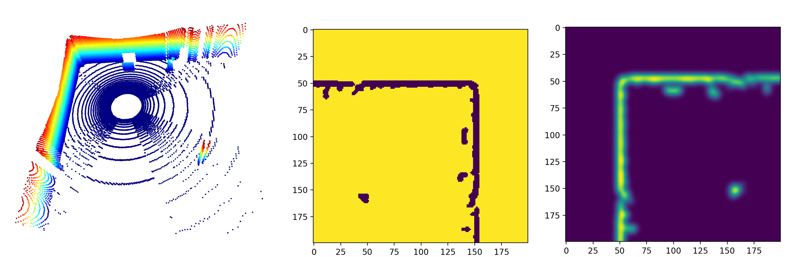
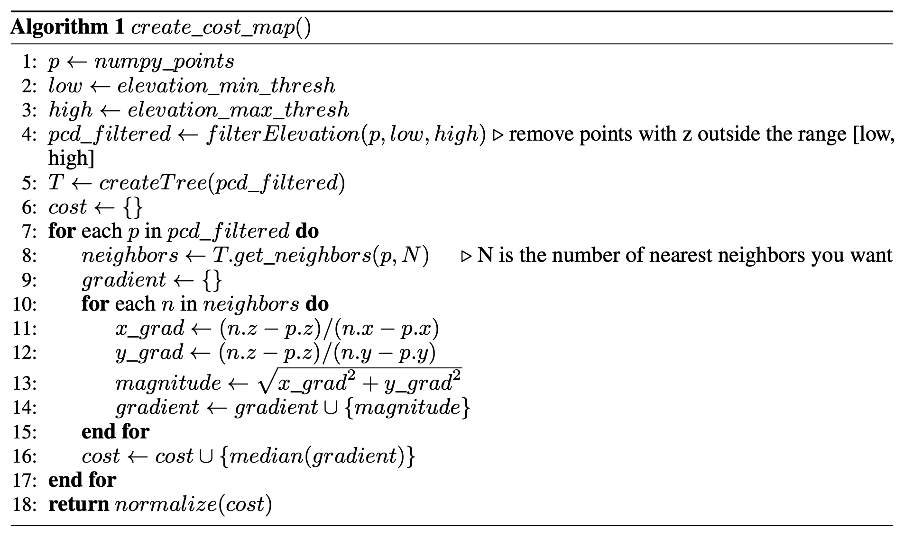

[](https://classroom.github.com/a/y2D8x3T2)
# Robot Perception - Cost Mapping

### Deadline : November 1st, 2024 11:59pm

***This class activity is to be done as individuals, not with partners nor with teams.***

### How to get started →

Begin by reading this entire writeup and making sure you have a good understanding of it. Next, spend some time planning how you’re going to approach the problem. 

# Introduction

---

In this assignment, you will implement SLAM based mapping and cost-map generation based on algorithms provided to you. The assignment is divided in two parts, for the 1st part you will setup, build and run a popular LiDAR SLAM pipeline to generate a dense point cloud map. In part 2 you will convert this point cloud into a cost map which can then be used for obstacle avoidance and shortest path planning. 


# Activity Information

---

### Objectives

- Learn how to build an run large SLAM pipelines
- Implement Cost-mapping and generate occupancy maps
- Test the implementation on a dataset of LiDAR scans
  

### Resources

- [Quick Introduction to SLAM](https://ouster.com/insights/blog/introduction-to-slam-simultaneous-localization-and-mapping)
- [FAST-LIO2](https://arxiv.org/abs/2107.06829)

### Requirements

- Your ROS package should run without errors
- Your code should be well documented
- Your code should NOT download the dataset from the internet (we will have a copy of the dataset)

  
### What we provide

- Detailed instructions to download the dataset and run FAST-LIO2
- A sample cost map generated using the algorithm described

### FAST-LIO2

FAST-LIO2 is a LiDAR SLAM system that uses LiDAR and IMU data in a tightly-coupled manner for pose estimation and mapping. The system generates high-resolution point cloud maps such as the one shown below.


Image shows point cloud map of Davis hall atrium generated using the Spot robot and a Ouster LiDAR using FAST-LIO2.

You can start with setting up FAST-LIO2 in your ROS environment. The code and detailed instructions are provided [here](https://github.com/hku-mars/FAST_LIO)

**Note: Make sure to read the entire READMe and follow all the steps. You should NOT have to make any changes to the source code. You WILL have to update the config YAML files to update the topic names**


### The Datasets

We provide datasets that you will use to generate point clouds using FAST-LIO2. The datasets can be downloaded here in the form of `rosbags`. The rosbags contain various topics among which you'll find `/ouster_points` and `/imu/data` which are of type `sensor_msgs/Pointcloud2` and `sensor_msgs/Imu` respectively. The `rosbags` can be downloaded [here](https://buffalo.box.com/s/lsdgizcjtni97loigb7c4ulv2otf5ayx)


### What to submit

You must submit a package with the following file structure


```bash
cost-mapping
├── launch
│   └── occupancy.launch # Should launch your occupancy grid publisher
├── src
│   └── cost-mapping.py # Your code to generate cost maps from point clouds
│   └── occupany.py # Your ROS node for publishing occupancy grid
├── params.yaml # Your parameter file
├── package.xml
└── CMakeLists.txt
```

Your code should accept parameters from the `params.yaml` file. The file should contain the following fields:

```yaml
point_cloud_path: xyz.pcd
elevation_thres_max: 10m
elevation_thres_min: 0m
nearest_neighbors: 30
cost_thres: 0.5 # Normalized cost between 0-1
occupancy_topic: occupancy_grid
```

*Please make sure you adhere to the structure above, if your package doesn’t match it the auto-grader will invariably give you a **zero***

### Grading considerations

- **Late submissions:** Carefully review the course policies on submission and late assignments. Verify before the deadline that you have submitted the correct version.
- **Environment, names, and types:** You are required to adhere to the names and types of the functions and modules specified in the release code. Otherwise, your solution will receive minimal credit.

# Part 1 : Point Cloud Mapping

---

In this part, you will generate point cloud maps using FAST-LIO2 and the dataset provided. The point cloud should be in `.pcd` and should be complete (make sure to run the entire bag). Do Not Upload the generated pointcloud (.pcd)

### Plan of attack (Optional)

1. Start by setting up FAST-LIO2. Update the topic names in the config to match the Pointcloud2 and IMU topics in the bag provided.
2. Run FAST-LIO2 and play the bag using `rosbag play <name>.bag`.
3. Visualize results in `rviz` (FAST-LIO2 launch will start a `rviz` window)
4. On completion the point cloud map will be saved in PCDs
5. Inspect the point cloud using [CloudCompare](https://www.danielgm.net/cc/) or PCL Tools


# Part 2 : Cost Mapping

---


> The first figure shows the 3D scan taken by a LiDAR onboard a robot. The second figure shows a binary cost map with traversable region having a value of 0 and non-traversable region having a value of 1. A hyper-parameter determines traversability. The third figure show a real-valued cost map. Here each pixel has a finite value which can be used to compute realistic costs

Once you have your point cloud map and want to use it for robot navigation, you need to convert it into a cost map. A cost map in robotics is a representation of the environment that includes information about potential costs associated with traversing to different locations. This information helps robots make informed decisions and plan efficient paths to achieve their goals. You will implement a cost map algorithm that takes into account the gradient of elevation to assign cost. 

### Cost Mapping Algorithm




1. Read the PCD using open3d (you can refer to the ICP activity)
2. Convert the open3d format to a numpy array (open3d has a function for this)
3. T is tree data structure. This drastically speeds up your nearest neighbor searches. We recommend that you use the KDTree from Scipy
4. The median function should calculate the median value in the passed list
5. The normalize function should normalize all the values in the cost list to be between 0-1

### Occupancy Grid

After successfully generating a cost map, we can simplify it by thresholding the cost to generate a occupancy grid. Meaning, we will set a certain cost above which the terrain/region is not traversable for the robot and below which it is. The occupancy grid can then be used for graph-based path planning.

You will write a ROS node `occupancy` which will take a static point cloud map (from FAST-LIO2), use your cost mapping algorithm to generate a cost map, threshold it and publish an occupancy grid (`nav_msgs/OccupancyGrid`)/

### Plan for Attack (Optional)

1. Implement the cost mapping algorithm in `cost-mapping.py` as a function you can call. Function should be as follows
   `def cost_map(pointcloud:open3d.geometry.PointCloud, ele_max: float, ele_min: float, nn: int): -> numpy.array`
2. Write your ROS Node that imports `cost-mapping.py` and calls your `cost-map` function to generate cost map
3. Threshold the cost map to generate an occupancy
4. Publish occupancy grid

# Submission and Assessment

---

Submit using the Github upload feature on [autolab](https://autolab.cse.buffalo.edu)

**Note: Make sure your code complies to all instructions, especially the naming conventions. Failure to comply will result in zero credit**

You will be graded on the following. Penalties are listed under each point, absolute values, w.r.t activity total.

1. Part 1 (Point Cloud Mapping) [15%] 
2. Part 2 (Cost Mapping) [85%]
    1. Correctness of cost-map algorithm [45%]
    2. Publishing occupancy grid [40%]

**Note: You will not receive partial credit for files working /not working. Please make sure your scripts execute**
