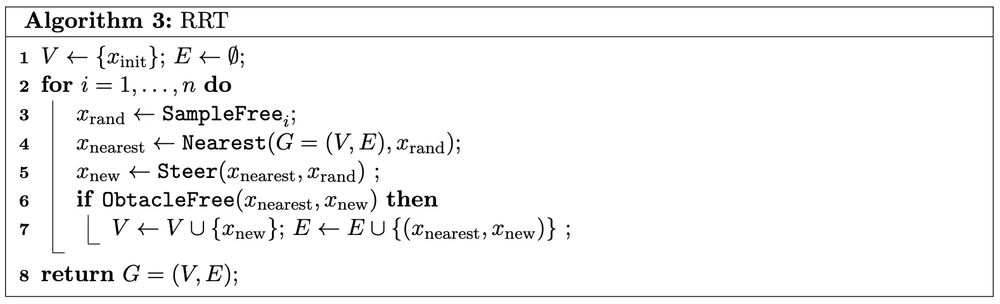

[](https://classroom.github.com/a/8wfDAk5R)
# Path Planning

### Deadline : November 22nd, 2024 11:59pm

***This assignment is to be done as individuals, not with partners nor with teams.***

### How to get started →

Begin by reading this entire writeup and making sure you have a good understanding of it. Next, spend a good amount of time, maybe an entire day, planning and sketching out on paper how you’re going to solve this assignment. Take note of the topics in the [resources](#Resources) section as your questions might already be covered there. You should aim on identifying what features you need to implement, which functions and classes you’ll need and how you’ll test and evaluate your algorithm.

---
# Introduction

In this assignment, you will be implementing three global path planning Algorithms. The word global implies that you have a complete map and you are planning in a complete representation of the world. For this assignment you are required to implement the Djikstra's algorithm, the A* algorithm and RRT.

---
# Assignment Information
Your algorithms/methods must be implemented in the respective files (`astar.py`, `djikstras.py` and `RRT.py`). Each of these files has a `get_path` function which takes a 2D binary grid. Calling this function should return the path as list of coordinates from start to goal where each coordinate is a tuple (x,y). These functions currently raise an error, comment/delete that line when you implmenent the them. You are free to declare any more functions, classes, etc within these files. You are also allowed to import any of the following python libraries - numpy, collections, os, math, matplotlib.

The file `planner.py` demonstrates how your functions will be called during grading. Do not make any changes to `planner.py`.

The worlds that you will plan in have been provided as png files. `planner.py` correctly loads these and passes it as a 2D numpy array of 0s and 1s (similar to the graph_planning_activity) to your function.

Similar to the activity: graph planning 1, the method, start, goal and the map name is specified in a `params.yaml` file

*NOTE 1: You are allowed to reuse any of **your own code** from the activity graph planning 1. Using someone else's code will be considered an AI Violation*

*NOTE 2: These worlds are quite large - (map1:550x550) and (map2:720x720) so your algorithms may take time to compute.*


### Objectives

- Implement graph planning algorithms - djikstras, A*
- Implement RRT
<!-- - Understand reactive controllers -->

### Resources
- A*, Djikstras: (https://lavalle.pl/planning/ch2.pdf)) sections 2.2.2 and 2.3.3
- RRT: [https://docs.ros.org/en/noetic/api/sensor_msgs/html/msg/LaserScan.html](https://www.youtube.com/watch?v=QR3U1dgc5RE&t=955s)
- RRT Visualized: [text](https://www.youtube.com/watch?v=Ob3BIJkQJEw)

### Requirements

- Your `get_path` functions in each of the files should return the path as a list of tuples.
- Your path should not go through a wall, however touching a wall is acceptable.
- Your files should follow the naming convention, if your code does not work due to the filenames being incorrect, you will receive zero points.

### What we provide

- Several template code `.py`
- A driver python file `planner.py` to test your algorithms

### What to submit


```bash
path_finding
├── planner.py
├── astar.py 
├── djikstras.py
├── RRT.py
├── map1.png
├── map2.png
└── params.yaml
```

*Please make sure you adhere to the structure above, if your package doesn’t match it the auto-grader will invariably give you a **zero***

### Grading considerations

- **Late submissions:** Carefully review the course policies on submission and late assignments. Verify before the deadline that you have submitted the correct version.
- **Environment, names, and types:** You are required to adhere to the names and types of the functions and modules specified in the release code. Otherwise, your solution will receive minimal credit.

---
# Part 1 : Djikstras Algorithm

In this part, you will implement the djikstras shortest path algorithm. If there are any ties in the cost for selection of a node you can break them randomly. The distance from a node to its direct horizontal neighbours is 1 and diagonal neighbours is sqrt(2).

### Hints (Optional)

1. Reuse your code for the general forward search. You can transform that into the djikstras algorithm with slight modifications.
2. You may have to implement a custom priority queue that sorts by cost that the djikstras algorithm uses.
3. The given map is quite large and your algorithm will take time to compute so you might benefit from testing it initially on the grid in the graph planning activity.

---
# Part 2 : A* Algorithm

In this part, you will implement the A* shortest path algorithm. If there are any ties in the cost for selection of a node you can break them randomly. The distance from a node to its direct horizontal neighbours is 1 and diagonal neighbours is sqrt(2). Use euclidean distance for the heuristic.

### Hints (Optional)

1. Reuse your code for djikstras algorithm. You can transform that into the A* algorithm with slight modifications.
2. You may have to implement a custom priority queue that sorts by the g-cost.
3. The given map is quite large and your algorithm will take time to compute so you might benefit from testing it initially on the grid in the graph planning activity.

---
# Part 3 : RRT

In this part, you will implement a Rapidly exploring Random Tree (RRT). Use euclidean distance for finding the nearest node. The algorithm is described below



You may terminate your RRT if there is a direct obstacle free connection from any of the nodes in the tree to the goal.
### Hints (Optional)
1. There is no need to create a Graph for this part.You will greatly benefit from creating a node class with info about the parent, co-ordinates and maintaining a list of nodes instead.
2. You can use an RNG seed for reproducible results.
3. RRT terminates very fast so the size of the map is not an issue but you can still test on a smaller grid similar to the previous parts if you wish to.

# Submission and Assessment

---

Submit using the Github upload feature on [autolab](https://autolab.cse.buffalo.edu)

**Note: Make sure your code complies to all instructions, especially the naming conventions. Failure to comply will result in zero credit**

You will be graded on the following. If any of your path goes through a wall you will get a zero for that section

1. Part 1 (Djikstras) [33%] 
2. Part 2 (A*) [33%]
3. Part 3 (RRT) [34%]
    
